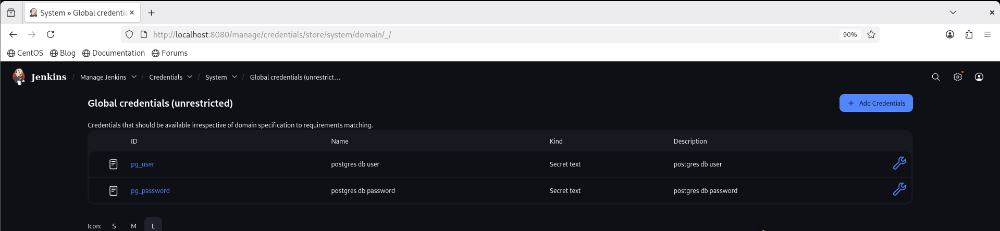
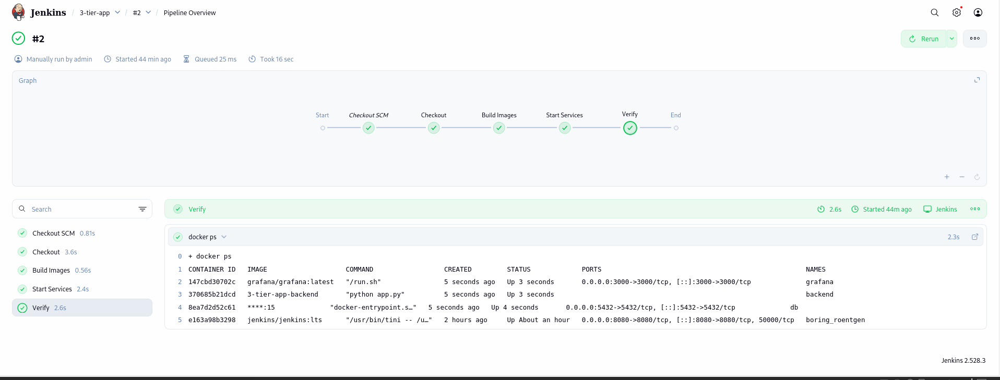
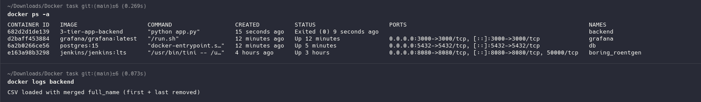
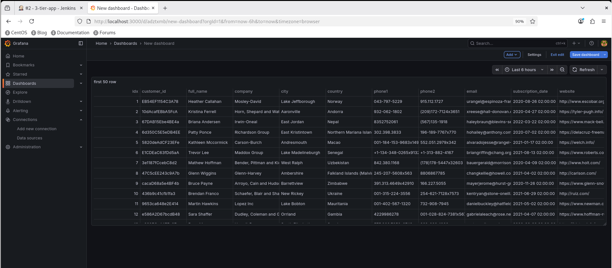

# 3-Tier Application with Jenkins

## Architectue

```bash
+---------------------------------------------------+
|                    Single VM                      |
|                                                   |
|                                                   |
|  +-----------+     +-----------+     +----------+ |
|  |  Grafana  | <-- |  Backend  | --> | Database | |
|  | Container |     | Container |     |Container | |
|  +-----------+     +-----------+     +----------+ |
|         ^                                         |
|         |                                         |
|     Jenkins Container (CI/CD)                     |
+---------------------------------------------------+

```

---

## Project Structure

```bash
.
├── Backend
│   ├── app.py
│   ├── customers.csv
│   ├── DockerFile
│   └── requirements.txt
├── DB
│   └── init.sql
├── Grafana
│   └── provisioning
│       └── datasources
│           └── datasource.yml
├── JenkinsFile
├── docker-compose.yml
└── README.md
```

---

## Jenkins installation

```bash
sudo docker run -p 8080:8080 --name jenkins -d \
-v jenkins_home:/var/jenkins_home \
-v /var/run/docker.sock:/var/run/docker.sock \
-v $(which docker):/usr/bin/docker jenkins/jenkins:lts

```

Get initail admin password

```bash
docker exec -it jenkins cat /var/jenkins_home/secrets/initialAdminPassword
```

install docker compose command in container

```bash
docker exec -it --user root jenkins bash
apt-get update
apt-get install -y curl jq

DOCKER_COMPOSE_VERSION=$(curl -s https://api.github.com/repos/docker/compose/releases/latest | jq -r .tag_name)
curl -SL https://github.com/docker/compose/releases/download/${DOCKER_COMPOSE_VERSION}/docker-compose-linux-x86_64 -o /usr/local/bin/docker-compose

chmod +x /usr/local/bin/docker-compose

docker-compose --version

```

Open Jenkins → http://VM_IP:8080

---

## Create Credentials in Jenkins

1. In Jenkins UI
   Manage Jenkins → Credentials → Global → Add Credentials

2. Add 2 credentials
   Credential:1
   Kind: Secret text
   ID: pg_user
   Secret: postgres

Credential 2:
Kind: Secret text
ID: pg_password
Secret: postgres

✅ These IDs are important — we’ll use them in the Jenkinsfile.



---

## Create Pipeline

1. Create Pipeline Job
2. Point to repo containing Jenkinsfile

   

3. Build 🚀



---

## Verification:

- Containers

```bash
docker ps
```

- Backend logs

```bash
docker logs backend
```



- Grafana

```bash
http://VM_IP:3000
user: admin
pass: admin
```

Create a dashboard using PostgreSQL datasource.


